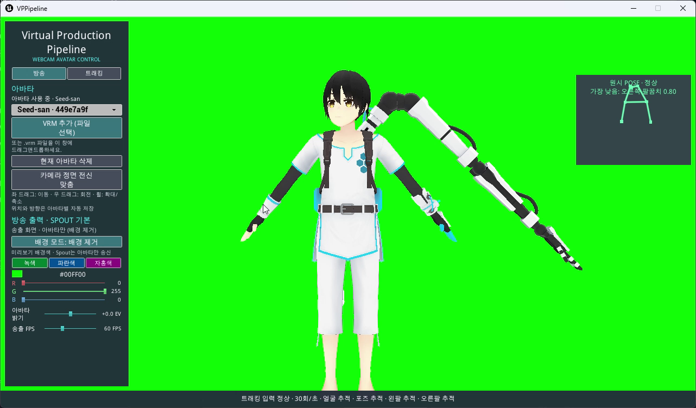
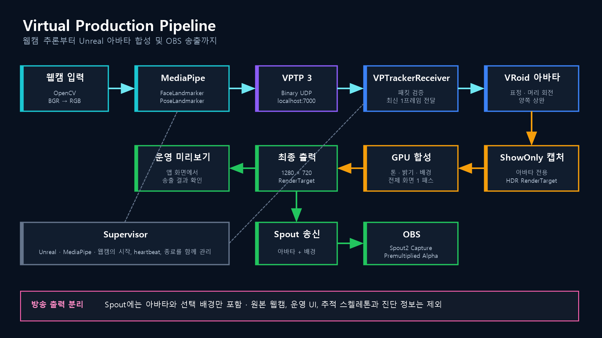
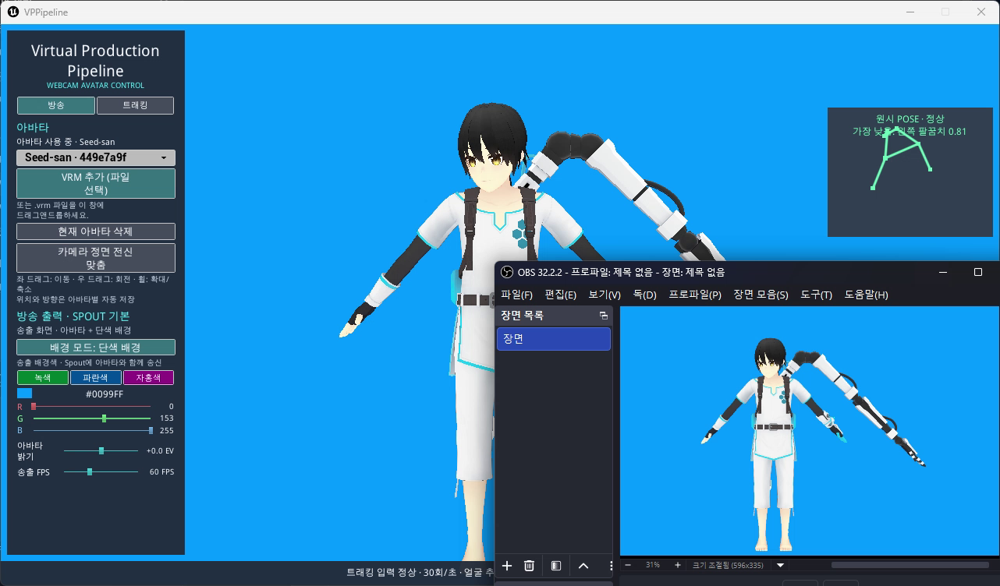

# Virtual Production Pipeline

<p align="center">
  
</p>

웹캠 한 대로 얼굴과 상반신 움직임을 추적해 VRoid 아바타에 반영하고, 완성된 아바타 영상을 OBS로 전달하는 Windows 앱입니다. Unreal Engine 5.8로 화면과 아바타를 렌더링하며 MediaPipe로 얼굴·머리·양쪽 팔 움직임을 추론합니다.

추적과 렌더링은 사용자의 PC 안에서 처리됩니다. 원본 웹캠 영상과 앱 조작 화면은 OBS에 전달되지 않습니다.

## 목차

- [Windows 앱 실행](#windows-앱-실행)
- [주요 기능](#주요-기능)
- [구현 구조](#구현-구조)
- [주요 문제 해결](#주요-문제-해결)
- [VPTP 통신 규격](#vptp-통신-규격)
- [소스 빌드](#소스-빌드)
- [프로젝트 구성](#프로젝트-구성)
- [검증 결과](#검증-결과)
- [개발 방식과 역할](#개발-방식과-역할)
- [주의사항](#주의사항)
- [라이선스와 에셋](#라이선스와-에셋)

## Windows 앱 실행

배포 폴더의 `VirtualProductionPipeline.exe`를 실행합니다. Unreal Engine과 Python을 별도로 설치할 필요는 없습니다. 배포 폴더 안의 파일은 이동하거나 삭제하지 말고 폴더 전체를 함께 보관해야 합니다.

1. `VRM 추가`를 누르거나 VRM 파일을 앱 창으로 끌어 놓습니다.
2. 트래킹 화면에서 웹캠을 선택하고 트래킹을 시작합니다.
3. 얼굴·양쪽 어깨·팔꿈치가 인식되면 `중립 자세 캘리브레이션 (3초)`을 실행합니다.
4. 방송 화면에서 배경, 아바타 밝기와 송출 FPS를 조정합니다.
5. OBS에 Spout2 Capture 소스를 추가하고 송신자를 `Virtual Production Pipeline`, 합성 방식을 `Premultiplied Alpha`로 설정합니다.

트래킹 화면의 `C` 키는 중립 자세 캘리브레이션을 시작하거나 취소하고, `F1` 키는 조작 화면을 표시하거나 숨깁니다. 방송 미리보기에서는 마우스 왼쪽 드래그로 이동하고, 오른쪽 드래그로 회전하며, 휠로 확대·축소할 수 있습니다.



앱을 닫으면 트래커와 웹캠도 함께 종료됩니다. 시작에 실패하면 `%LOCALAPPDATA%\VirtualProductionPipeline\Logs`에서 상세 기록을 확인할 수 있습니다.

## 주요 기능

- VRM 파일 선택, 드래그 추가, 교체와 삭제
- 얼굴 표정, 머리 회전과 양쪽 팔 들기 추적
- 3초 중립 자세 캘리브레이션과 단계별 팔 추적 확인
- 아바타별 카메라 위치, 캘리브레이션과 움직임 설정 저장
- 정면 전신 맞춤과 이동·회전·확대/축소 카메라 조작
- 웹캠에서 감지한 자세, 부위별 인식 신뢰도, 트래킹 입력률과 통신 지연 표시
- 투명 또는 단색 배경, 아바타 밝기와 배경색 조정
- 앱과 OBS에 동일하게 적용되는 15~144 송출 FPS

| 구현 영역 | 내용 |
|---|---|
| 동작 추론 | MediaPipe Face Landmarker와 Pose Landmarker를 비동기로 실행해 얼굴·머리·양쪽 상완 값을 생성합니다. |
| 데이터 수신 | [`VPUDPReceiver`](./VPPipeline/Plugins/VPTrackerReceiver/Source/VPTrackerReceiver/Private/VPUDPReceiver.cpp)가 패킷을 검증하고 가장 최근 프레임만 전달합니다. |
| 아바타 제어 | [`VPAnimInstance`](./VPPipeline/Plugins/VPTrackerReceiver/Source/VPTrackerReceiver/Private/VPAnimInstance.cpp)가 표정·머리·상완 움직임을 적용합니다. |
| 방송 출력 | [`VPBroadcastRenderer`](./VPPipeline/Plugins/VPBroadcastRenderer/Source/VPBroadcastRenderer/Private/VPBroadcastRenderer.cpp)가 아바타와 배경을 합성해 앱 미리보기와 Spout에 전달합니다. |
| 실행 관리 | [`supervisor.py`](./vp-tracker/supervisor.py)가 앱과 트래커를 함께 시작하고 종료하며 중복 실행과 웹캠 점유를 방지합니다. |
| 사용자 화면 | [`VPTrackingDashboard`](./VPPipeline/Source/VPPipeline/VPTrackingDashboard.cpp)를 C++ UMG로 구현했습니다. |

## 구현 구조



- 원본 웹캠 영상은 움직임 추적에만 사용하며 파일로 저장하지 않습니다.
- Python과 Unreal 사이에는 영상 대신 얼굴·포즈 수치와 추적 상태만 같은 PC 안에서 전달합니다.
- Spout 출력에는 아바타와 선택한 배경만 포함되며 원본 웹캠, 조작 화면, 추적 스켈레톤과 진단 정보는 포함되지 않습니다.

## 주요 문제 해결

### 쌓이지 않는 최신 프레임 처리

네트워크 수신이 렌더링보다 빨라도 오래된 동작을 순서대로 재생하지 않도록 가장 최근 프레임 하나만 유지합니다. 건너뛴 이전 프레임과 잘못된 패킷은 별도로 집계해 지연과 데이터 오류를 구분합니다.

### 상반신 구도에 맞춘 팔 추적

손목이 화면 밖으로 나가기 쉬운 촬영 환경을 고려해 양쪽 어깨와 팔꿈치만으로 상완 움직임을 계산합니다. 순간적으로 크게 튀는 입력을 억제하고 팔이 몸에 가려지면 마지막 안정 자세를 잠시 유지한 뒤 몸통과 겹치지 않는 자세로 복귀합니다.

### 추적이 끊겼을 때의 복구

입력이 끊기거나 인식 신뢰도가 계속 낮으면 표정·머리·상완을 중립 자세로 되돌립니다. 캘리브레이션 중 추적이 잠시 끊기면 최대 5초간 기다리고, 입력이 돌아오면 카운트다운을 다시 시작합니다.

### 최소화 이후 입력률 오표시 방지

트래킹 입력률은 실제 경과 시간으로 계산합니다. 앱 최소화 등으로 화면 갱신이 오래 멈추면 그동안 쌓인 표본을 버리고 새로 측정해 복원 직후 입력률이 비정상적으로 높게 표시되지 않도록 했습니다.

### 트래킹을 멈추지 않는 파일 선택창

VRM 선택창은 트래킹과 분리해 실행합니다. 선택창이 열린 상태에서 `VRM 추가`를 다시 누르면 기존 창을 앞으로 가져오며, 입력 중인 경로를 유지하고 중복 창을 만들지 않습니다. 선택 취소, 선택창 다시 열기와 앱 종료도 정상적으로 처리합니다.

### 앱 화면과 OBS 출력 분리

아바타를 별도로 캡처한 뒤 밝기와 배경을 한 번에 합성합니다. 앱 미리보기와 Spout가 같은 1280×720 결과를 사용하므로 움직임과 색상이 일치하며 조작 화면은 방송에 노출되지 않습니다.



## VPTP 통신 규격

MediaPipe 결과는 `127.0.0.1:7000`으로만 전송합니다. VPTP 3은 928바이트 고정 크기이며 수신기는 식별자, 버전, 플래그, 항목 수, 패킷 길이와 각 수치의 유효 범위를 확인합니다. 별도 애플리케이션 체크섬은 사용하지 않으며 UDP 체크섬과 수신 검증으로 같은 PC 안의 통신 오류를 거릅니다.

<details>
<summary>VPTP 3 패킷 구조 보기</summary>

| 위치 | 형식 | 내용 |
|---:|---|---|
| 0 | `char[4]` | 식별자 `VPTP` |
| 4 | `uint8` | 규격 버전 `3` |
| 5 | `uint8` | bit 0: 얼굴 추적, bit 1: 포즈 추적 |
| 6 | `uint16` | 예약 영역, 반드시 `0` |
| 8 | `uint32` | 프레임 번호 |
| 12 | `double` | 촬영 시각 |
| 20 | `uint16` | 표정 항목 수, 반드시 `52` |
| 22 | `float[52]` | 고정 순서의 표정 값 |
| 230 | `float[9]` | 얼굴 3×3 회전 행렬 |
| 266 | `uint16` | 포즈 항목 수, 반드시 `33` |
| 268 | `float[33][5]` | x, y, z, 가시성, 존재 신뢰도 |

</details>

## 소스 빌드

| 용도 | 구성요소 |
|---|---|
| Unreal 빌드 | Unreal Engine 5.8.2, Visual Studio 2022 C++ 도구 |
| 동작 추론 | Python 3.12 이상, `uv`, MediaPipe 모델 |
| VRM 불러오기 | VRM4U `v1.2026.07.22` |
| Spout 송신 | UE5_Spout2_DX12 `v2.1.1` |
| OBS 수신 확인 | OBS Studio, OBS Spout2 수신 플러그인 |

VRM4U, Spout2_DX12, MediaPipe 모델과 사용자 VRM 파일은 저장소에 포함하지 않습니다. 다음 명령은 고정된 버전의 VRM4U와 MediaPipe 모델을 내려받고 파일 무결성을 확인한 뒤 Python 개발 환경을 준비합니다. Spout2_DX12는 [공식 릴리스](https://github.com/GPUbrainStorm/UE5_Spout2_DX12/releases)에서 설치합니다.

```powershell
.\tools\vrm4u\Install-VRM4U.ps1
.\tools\mediapipe\Install-MediaPipeModels.ps1
cd vp-tracker
uv sync --group dev
```

소스에서 실행:

```powershell
cd vp-tracker
uv run launcher.py
```

Windows 배포본 생성과 실행 검사:

```powershell
.\tools\Build-OneClick.ps1 -Configuration Shipping -RunSmokeTest
```

완성된 배포본은 `Build/OneClick-Windows-Shipping`에 생성됩니다.

## 프로젝트 구성

```text
Virtual-Production-Pipeline/
├─ VPPipeline/
│  ├─ Plugins/VPTrackerReceiver/   # 추적 데이터 수신·검증·애니메이션
│  ├─ Plugins/VPBroadcastRenderer/ # 방송 화면 캡처·합성
│  ├─ Source/VPPipeline/           # 사용자 화면·게임 런타임
│  └─ VPPipeline.uproject
├─ tools/                           # 외부 구성요소 설치·배포 자동화
└─ vp-tracker/                      # MediaPipe 추론·전송·프로세스 관리
```

## 검증 결과

2026년 9월 11일 기준입니다.

- 통신·트래킹·UI/방송·프로세스 수명주기부터 Windows 배포 환경까지 단계별 검증
- Python 프로토콜·카메라·제어 채널·비동기 추론·종료 처리 테스트 통과
- Unreal 패킷 검증·애니메이션·캘리브레이션·카메라·방송·사용자 화면 테스트 통과
- Unreal Engine 5.8 Development Editor와 Win64 게임 빌드 성공
- Windows 배포본 747개 파일·758.6MiB 생성
- Windows 배포본의 구성·실행·종료 및 자원 정리 검증 완료
- 실제 1280×720 웹캠 입력에서 MediaPipe 얼굴·포즈 추론 약 29~31fps 확인
- 실제 VRM 추가·교체·삭제, 설정 복원, 1280×720 Spout 송신과 OBS 합성 확인
- 앱 종료 후 프로세스, UDP 포트, Spout 송신자와 웹캠이 남지 않는 것을 확인

## 개발 방식과 역할

요구사항과 기능 범위, Python–Unreal 통신 구조와 검증 기준은 직접 정의했습니다. OpenAI Codex를 코드 작성과 반복 검증에 활용했으며, 결과물은 Python 테스트·Unreal 자동화 테스트·Win64 빌드와 웹캠·VRM·Spout·OBS 실제 실행으로 확인했습니다.

## 주의사항

- 웹캠 한 대로 얼굴과 정면 상반신을 추적합니다. 팔꿈치 굽힘, 하완, 손목과 손가락 움직임은 반영하지 않습니다.
- 표준 VRoid 모델을 기준으로 제작했습니다. 뼈대 구조가 다른 VRM은 움직임이 자연스럽지 않을 수 있습니다.
- 방송과 녹화의 시작·종료 및 OBS 영상 설정은 OBS에서 직접 조작합니다.
- 배포용 실행 파일은 코드 서명 인증서가 없어 Windows에서 보안 경고가 표시될 수 있습니다.

## 라이선스와 에셋

이 저장소에는 프로젝트 자체의 별도 오픈소스 `LICENSE`가 없습니다. 외부 구성요소와 에셋의 출처와 포함 범위는 [THIRD_PARTY_NOTICES.md](./THIRD_PARTY_NOTICES.md)에 정리했습니다.

- Unreal Engine은 [Unreal Engine EULA](https://www.unrealengine.com/eula/unreal)에 따라 사용합니다.
- VRM4U, Spout2_DX12와 MediaPipe 모델에는 각 배포자의 이용조건이 적용됩니다.
- 사용자가 등록하는 VRM에는 해당 모델의 메타데이터와 원저작자 이용조건이 적용됩니다.
- 데모의 **Seed-san** 저작권자는 **VirtualCast, Inc.**입니다. 모델 파일은 포함하지 않으며 [Seed-san 공식 이용조건](https://wiki.virtualcast.jp/wiki/vrm/seedsanvrm)이 적용됩니다.
